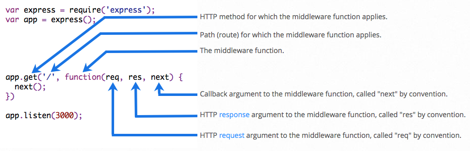

# Express

## Qué es express?
Es un framework web minimalista que nos simplifica muchas de las tareas que podemos llegar a realizar al momento de crear una aplicación web.

## Instalación

**Core:**
```
npm install express --save
```

**Generador:**
```
npm install express-generator -g
```


## Creando un servidor

```javascript
var express = require('express')
var app = express()

app.get('/', function (req, res) {
  res.send('Hello World!')
})

app.listen(3000, function () {
  console.log('Server running at 3000')
})
```

## Rutas
Las rutas nos permite responder de forma diferente ante distintas peticiones. Por ejemplo el resultado de solicitar a través del método get la url `/posts` no debe ser la misma que si el path es `/comments`. 
Para enrutar dichas peticiones en express debemos seguir el siguiente patrón:

```
app.METHOD(PATH, HANDLER)
```

- Method: corresponde al verbo http usado en la petición
- Path: es la parte de la url que sigue al dominio. Por ejemplo: si la url es `http://localhost/users` entonces el path va a ser `/users`.
- Handler: es la función que se va a encargar de preparar la respuesta.

### Métodos

#### Get
Por convención las peticiones de tipo GET se utilizan para obtener datos. Por ejemplo: una lista de comentarios en formato JSON.
```javascript
app.get('/', function (req, res) {
  res.send('Hello World!')
});
```

#### Post
Por convención las peticiones de tipo POST se utilizan para crear entidades. Por ejemplo: un formulario de comentarios va a utilizar el método post para crear un nuevo comentario.
```javascript
app.post('/', function (req, res) {
  res.send('Got a POST request')
});
```

#### Put
Por convención las peticiones de tipo PUT se utilizan para editar una entidad existente. Por ejemplo: editar un post que ya se encuentre creado
```javascript
app.put('/', function (req, res) {
  res.send('Got a PUT request at /user')
})
```

#### Delete
Por convención las peticiones de tipo DELETE se utilizan para borrar entidades.
```javascript
app.delete('/user', function (req, res) {
  res.send('Got a DELETE request at /user')
})
```


### Parámetros

#### Parámetros por path
Para crear un parámetros para una url debemos utilizar la siguiente sintaxis: `:param`.

El siguiente código va a enviar como resultado de la request el userId que le pasamos por parámetro.
```javascript
app.get('/users/:userId', function (req, res) {
  res.send(req.params.userId);
})
```

#### Parámetros por query
Si en lugar de utilizar el path queremos utilizar la query para pasar los parámetros (todo lo que está después del ? en la url) entonces vamos a utilizar el objeto query.

```javascript
app.get('/users', function (req, res) {
  res.send(req.query.userId);
})
```

Nótese que el path en ningún lugar indica que ese parámetro va a ser enviado.

## Middlewares

Los middlewares nos permiten meternos en el medio de una request de forma tal de poder agregar la funcionalidad durante el proceso. 

Son por lo tanto una forma de extender la capacidad de express a traves de funciones.

Para utilizar un middleware, express cuenta con el método `use`. 

Las operaciones básicas que realizan los middlewares son:
- Ejecutar cualquier tipo de código
- Cambiar los objetos req (request) and res (response)
- Terminar el ciclo de request-response
- Llamar al próximo middleware a través de la funcion `next`

### Middlewares mas utilizados

**body-parser:** se encarga de procesar las peticiones posts más comunes.
```javascript
var express = require('express')
var bodyParser = require('body-parser')
var app = express()
app.use(bodyParser.json({ type: 'application/*+json' }))
app.post('/api/users', function (req, res) {
  if (!req.body) return res.sendStatus(400);  
})
```

**serve-static:**
```javascript
var express = require('express')
var path = require('path')
var serveStatic = require('serve-static')
var app = express()
app.use(serveStatic(path.join(__dirname, 'public-optimized')))
app.use(serveStatic(path.join(__dirname, 'public')))
app.listen(3000)
```

**morgan:**
```javascript
var express = require('express')
var morgan = require('morgan')
var app = express()
app.use(morgan('combined'))
app.get('/', function (req, res) {
  res.send('hello, world!')
})
```

### Como crear tu propio middlewares
Para definir un nuevo middleware es muy simple. Debemos crear una función que reciba los parámetros req, res y next. Los nombres de dichos parámetros pueden variar, lo importante es el orden.
Una vez creada la funcion debemos pasarsela al metódo `use` para que la inserte en el ciclo request-response.

```javascript
var app = express()
app.use(function (req, res, next) {
  console.log('Time:', Date.now())
  next()
})
```

La función `next` debe ejecutarse en el momento que todo el trabajo del middleware actual haya finalizado. Cada vez que se llama a next el siguiente middleware es llamado hasta que ya no hay más y la respuesta es enviada al cliente.

```
request -> middleware1 -> middleware2 -> ... -> response
```

## 

### Ejercicio 21
Construyamos nuestro propio JSON server. Yay!
Qué debe hacer?
- Leer un archivo json
- Cada key del objeto json corresponde a un path en la url. En otras palabras `/comments` debería rutear a la key `comments` en el objeto json que estamos usando.
- Debemos utilizar streams
- Agregar la posibilidad de filtrar elementos según sus campos. Por ejemplo: obtener todos los comentarios cuyo autor sea igual a X.
- Para el hogar: agregar paginación, ordenamiento. 
